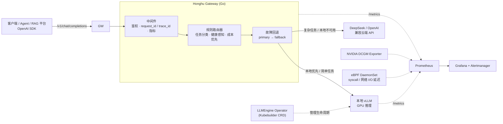

<div align="center">

# 🐯 Honghu LLM Infra Gateway

**企业级大模型推理网关 · 智能路由 · 成本与性能可观测 · GPU 平台治理**

一个能在面试中讲清楚、能在 EKS GPU 集群上落地、能用指标证明成本与性能收益的 AI Infra 作品。

[](go.mod)
[](#-api-示例)
[](#-可观测指标)
[](Dockerfile)
[](.github/workflows/ci.yml)

[快速开始](#-快速开始) · [架构](#-架构) · [智能路由](#-智能路由策略) · [API](#-api-示例) · [可观测](#-可观测指标) · [文档](#-文档索引)

</div>

---

## ✨ 项目定位

本项目**不是**一个简单的 LLM API 代理。它面向企业内部 AI 应用、Agent 平台、知识库 / RAG 平台与多模型平台，提供：

> **统一推理入口 · 智能路由 · 成本追踪 · GPU 资源治理 · vLLM 生命周期管理 · 内核级运行时观测**

目标岗位：`AI Infra 工程师` · `大模型推理平台工程师` · `Go 后端 / 云原生 AI 平台工程师` · `Kubernetes Operator 工程师`

---

## 🏗 架构



> 完整高清架构图见 [`docs/diagrams/system-architecture.svg`](docs/diagrams/system-architecture.svg)。

---

## 🚀 核心能力

| 模块 | 能力 |
| --- | --- |
| **推理网关** | Go 高性能 OpenAI-compatible 网关，支持 `chat/completions`（流式 + 非流式）与 `completions` |
| **统一接入** | 本地 vLLM 与 DeepSeek / OpenAI 兼容云端 API 统一出口，可热插拔 |
| **智能路由** | 基于任务复杂度、模型健康、token 规模与成本的混合路由，决策原因可追溯 |
| **故障回退** | primary → fallback 自动切换；流式仅在首个 chunk 前回退，保证语义正确 |
| **请求级追踪** | Token、费用、延迟、错误、模型选择原因全程 `request_id` / `trace_id` 关联 |
| **可观测体系** | Prometheus + Grafana + Alertmanager，统一采集 Gateway / vLLM / DCGM 指标 |
| **平台治理** | Kubebuilder `LLMEngine` CRD + Operator 管理 vLLM Pod 生命周期 |
| **基础设施** | Terraform 管理 AWS EKS GPU 节点组；Helm / Kustomize / Runbook 齐全 |
| **内核观测** | eBPF DaemonSet 采集 vLLM 进程 syscall / network I/O 延迟分布 |
| **可复现实验** | 压测、成本对比、故障演练与可复现报告 |

---

## ⚡ 快速开始

### 前置依赖

- Go **1.23+**
- （可选）Docker / Docker Compose

### 本地运行（零依赖，fake provider）

```bash
# 1. 启动网关（默认监听 :8080，自动启用 fake provider）
make run-gateway        # 等价于: go run ./cmd/gateway

# 2. 发一条请求
curl -s http://localhost:8080/v1/chat/completions \
  -H 'Content-Type: application/json' \
  -d '{"model":"demo","messages":[{"role":"user","content":"summarize hello"}]}'
```

### Docker Compose（网关 + vLLM 后端）

```bash
make deploy-local       # docker compose up --build
# gateway → http://localhost:8080 ，模拟 vLLM → http://localhost:8000
```

### 体验智能路由（无需任何模型）

```bash
go run ./cmd/router-bench    # 打印不同任务被路由到 local / cloud 的决策与原因
```

---

## 🧭 智能路由策略

路由器在每次请求时抽取文本、估算 token、识别任务类型，并结合 Provider 健康状态做出决策：

| 优先级 | 条件 | 决策 | reason |
| --- | --- | --- | --- |
| 1 | 本地不可用、云端可用 | → 云端 | `local_unavailable_route_cloud` |
| 2 | 简单任务（总结 / 分类 / 改写 / 抽取）且 `prompt ≤ 512` token | → 本地（降成本） | `simple_short_task_route_local` |
| 3 | 复杂任务（代码 / 推理） | → 云端（保质量） | `complex_task_route_cloud` |
| 默认 | 本地可用 | → 本地优先 | `default_local_first` |

> 💡 **性能优化**：Provider 健康探测带 **独立短超时 + TTL 缓存**，避免在请求热路径上对每个云端 Provider 发起阻塞式探测（最坏情况下原本会用 60s 请求超时拖慢每一次路由决策）。

---

## 📡 API 示例

<details open>
<summary><b>Chat Completion（非流式）</b></summary>

```bash
curl -s http://localhost:8080/v1/chat/completions \
  -H 'Content-Type: application/json' \
  -d '{"model":"honghu-local-demo","messages":[{"role":"user","content":"write Golang code for a retry client"}]}'
```

</details>

<details>
<summary><b>Chat Completion（SSE 流式）</b></summary>

```bash
curl -N http://localhost:8080/v1/chat/completions \
  -H 'Content-Type: application/json' \
  -d '{"model":"demo","stream":true,"messages":[{"role":"user","content":"summarize hello"}]}'
```

</details>

| 方法 | 路径 | 说明 |
| --- | --- | --- |
| `POST` | `/v1/chat/completions` | OpenAI 兼容聊天补全（支持 `stream`） |
| `POST` | `/v1/completions` | 兼容旧版补全 API |
| `GET` | `/v1/models` | 模型列表 |
| `GET` | `/healthz` · `/health` | 存活检查（`/health` 为 vLLM 兼容别名） |
| `GET` | `/readyz` | 就绪检查（至少一个 Provider 健康） |
| `GET` | `/metrics` | Prometheus 指标 |

**鉴权**：设置 `GATEWAY_API_KEYS` 后，需带 `Authorization: Bearer <key>` 或 `X-API-Key: <key>`。

---

## 📊 可观测指标

所有响应都会回写 `X-Request-ID` / `X-Trace-ID`，并暴露以下 Prometheus 指标：

| 指标 | 类型 | 标签 | 含义 |
| --- | --- | --- | --- |
| `llm_gateway_requests_total` | Counter | route, method, status, provider | 请求总数 |
| `llm_gateway_request_duration_seconds` | Histogram | route, provider | 请求耗时分布 |
| `llm_gateway_first_token_duration_seconds` | Histogram | provider | 流式首 token 延迟（TTFT） |
| `llm_gateway_tokens_total` | Counter | provider, type | prompt / completion / total token 用量 |
| `llm_gateway_route_decisions_total` | Counter | provider, task, reason | 路由决策分布 |
| `llm_gateway_provider_errors_total` | Counter | provider | Provider 错误数 |
| `llm_gateway_in_flight_requests` | Gauge | — | 当前在途请求数 |

---

## ⚙️ 配置项

通过环境变量配置（参见 [`.env.example`](.env.example)）：

| 变量 | 默认值 | 说明 |
| --- | --- | --- |
| `GATEWAY_ADDR` | `:8080` | 监听地址 |
| `DEFAULT_MODEL` | `honghu-fake-llm` | 默认模型名 |
| `GATEWAY_API_KEYS` | *(空)* | 逗号分隔的租户 API Key，留空则不鉴权 |
| `LOCAL_VLLM_URL` | *(空)* | 本地 vLLM 地址，配置后启用本地路由 |
| `OPENAI_COMPATIBLE_URL` / `_API_KEY` | *(空)* | 任意 OpenAI 兼容云端 Provider |
| `DEEPSEEK_URL` / `DEEPSEEK_API_KEY` | `https://api.deepseek.com` | DeepSeek Provider |
| `PROVIDER_TIMEOUT` | `60s` | Provider 请求超时 |
| `ENABLE_FAKE_PROVIDER` | `false` | 强制启用 fake provider（本地开发） |
| `LOG_LEVEL` | `info` | `debug` / `info` / `warn` / `error` |

---

## 🗂 项目结构

```text
llm-infra-gateway/
├── cmd/                    # 可执行入口
│   ├── gateway/            #   推理网关主程序
│   ├── fake-vllm/          #    vLLM 后端（本地演示）
│   ├── router-bench/       #   路由决策基准 / 演示
│   ├── operator/           #   LLMEngine Operator（stub）
│   └── ebpf-agent/         #   eBPF 指标 agent（stub）
├── internal/
│   ├── config/             # 环境变量配置加载
│   ├── gateway/http/       # HTTP 层：路由 · 中间件 · SSE
│   ├── router/             # 规则路由器（任务分类 + 健康感知）
│   ├── provider/           # Provider 抽象（OpenAI 兼容 / fake）
│   └── observability/      # Prometheus 指标
├── api/v1alpha1/           # LLMEngine CRD 类型
├── deploy/ · infra/        # Helm / Kustomize / Terraform (EKS)
├── observability/          # Grafana / Prometheus rules / ServiceMonitor
├── benchmark/              # 压测数据集与报告
└── docs/                   # 项目计划 · 架构 · 验收 
```

---

## 🧪 测试与质量

```bash
make test    # go test ./...
make lint    # go vet ./...
go build ./...
```

CI（[`.github/workflows/ci.yml`](.github/workflows/ci.yml)）在每次 push / PR 上运行 `go test`、`go vet` 与 Docker 镜像构建。

---

## 📦 构建与部署

```bash
make docker-build              # 构建 distroless 镜像
docker run -p 8080:8080 honghu/llm-infra-gateway:dev
```

镜像基于 `gcr.io/distroless/static-debian12:nonroot`，多阶段构建、静态链接、非 root 运行。

---

## 📚 文档索引

| 文档 | 内容 |
| --- | --- |
| [项目计划](docs/PROJECT_PLAN.md) | 分阶段交付规划 |
| [系统架构](docs/ARCHITECTURE.md) | 架构设计与组件职责 |
| [Go 代码结构](docs/GO_STRUCTURE.md) | 包划分与依赖方向 |
| [本地 Runbook](docs/LOCAL_RUNBOOK.md) | 本地运行与排障 |
| [实施 Backlog](docs/delivery/IMPLEMENTATION_BACKLOG.md) | 任务拆解 |
| [验收标准](docs/delivery/ACCEPTANCE_CRITERIA.md) | Done 的定义 |
| [简历与面试 QA](docs/interview/RESUME_AND_QA.md) | 量化表述与答辩 |
| [薪资定位](docs/interview/SALARY_POSITIONING.md) | 岗位与包装 |

---

## 🎯 设计原则

1. **用数据说话** — 所有性能与成本收益必须用压测报告、Prometheus 指标和账单公式证明。
2. **eBPF 不夸大** — 它负责内核级 I/O 与 syscall 延迟；完整请求链路由 Gateway `traceId` + OpenTelemetry + Prometheus 关联。
3. **Operator 要有“运维心智”** — 不只是生成 Deployment，而要具备状态回写、滚动更新、故障自愈、扩缩容与可观测配置管理。
4. **部署要可复现** — Terraform、Helm、Kustomize、Runbook 齐全。
5. **量化优先于关键词** — 项目最终要能支撑简历中的量化表述。

---

## 🔗 官方依据

<table>
<tr><td>

- [vLLM Metrics](https://docs.vllm.ai/en/stable/design/metrics/)
- [vLLM OpenAI-Compatible Server](https://docs.vllm.ai/en/stable/serving/openai_compatible_server/)
- [AWS EKS NVIDIA GPU 管理](https://docs.aws.amazon.com/eks/latest/userguide/device-management-nvidia.html)
- [AWS EKS AI/ML 计算最佳实践](https://docs.aws.amazon.com/eks/latest/best-practices/aiml-compute.html)
- [NVIDIA DCGM Exporter](https://docs.nvidia.com/datacenter/dcgm/latest/gpu-telemetry/dcgm-exporter.html)

</td><td>

- [NVIDIA Kubernetes device plugin](https://github.com/NVIDIA/k8s-device-plugin)
- [Kubebuilder Book](https://book.kubebuilder.io/)
- [cilium/ebpf](https://github.com/cilium/ebpf)
- [Prometheus Operator API](https://prometheus-operator.dev/docs/api-reference/api/)
- [Prometheus Adapter](https://github.com/kubernetes-sigs/prometheus-adapter)

</td></tr>
</table>

<div align="center">

---

**Honghu LLM Infra Gateway** · 为真实的 AI Infra 工程能力而构建

</div>
